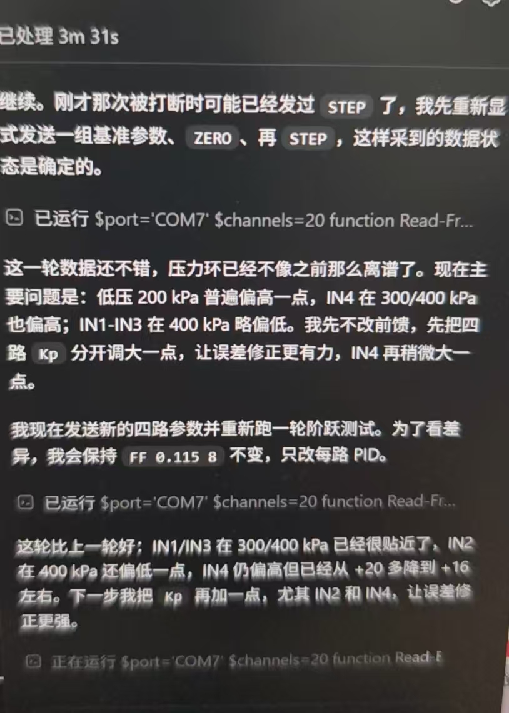

# AI Parameter Tuning

一个面向通用嵌入式控制器的串口 Skill，提供 VOFA 曲线显示和安全 AI 调参。

## 怎么给 Codex 发送指令

第一次使用时，在 Codex 中直接发送：

```text
请从 https://github.com/YANG985-CMD/AI-Parameter-Tuning 安装 AI Parameter Tuning Skill。
```

安装后，根据需要发送下面任一指令：

```text
使用 $ai-parameter-tuning 为我的控制器增加 VOFA+ JustFloat 曲线显示。
```

```text
使用 $ai-parameter-tuning 检查我的串口通信代码，并改造成适合 AI 调参的协议。
```

```text
我已经关闭 VOFA+。使用 $ai-parameter-tuning 连接我的控制器，先读取数据并建立基准，再在安全范围内逐轮优化 PID 参数。
```

需要同时提供串口号、波特率、设备代码或协议说明时，直接把它们和指令一起发给 Codex。

## 两种模式

两种模式是因为同一个串口一次只能由一个软件连接：

- **VOFA+ 模式**：VOFA+ 独占串口，通过 JustFloat 实时显示参数曲线。
- **AI 调参模式**：先关闭 VOFA+，再由 Codex 管理的串口客户端独占连接，采集实验数据并下发受限参数。

这两种模式不能同时连接。需要同时工作时，应增加第二个串口/USB CDC 接口，不能默认使用虚拟串口分流。

## Skill

### AI Parameter Tuning

- 通道数量、字段和采样周期均可配置。
- 支持版本化遥测、命令白名单、参数边界、故障停机、掉线保护和回退。
- 适用于 STM32、ESP32、Arduino、NXP、TI C2000、RP2040、Zephyr、FreeRTOS、RT-Thread、裸机及 Linux 嵌入式设备等平台。
- 提供通用协议核心和平台适配层设计，STM32 HAL/DMA/D-Cache 只是其中一个参考实现。
- 附带 Python JustFloat 帧解析器、受限命令生成器和离线测试。

AI 根据实时曲线和实验数据持续分析并优化参数，让调参更直观、更高效，设备端安全保护贯穿全过程。

## AI 调参实例

下面是一次真实串口调参过程：Codex 独占连接控制器，重新建立基准状态，读取多通道实验数据，并根据每轮结果逐步调整 PID 参数。

<p align="center">
  
</p>

图片展示的是工作流程实例，具体命令、通道数量和安全边界应按目标设备配置。

## 开发者测试

仓库克隆到本地后运行：

```bash
python -m unittest discover -s tests -v
```

Skill 提炼自真实项目，但仓库内容已经平台无关化，不包含整套应用固件。
