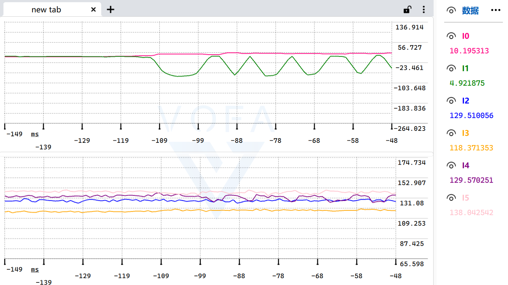

# AI Parameter Tuning

## 传统调参有多麻烦？

在 Keil、STM32CubeIDE、CCS、Arduino IDE 等代码编译软件中调参，往往需要不断重复：

```text
修改代码中的参数 → 重新编译 → 烧录设备 → 运行测试 → 记录结果 → 再修改
```

参数每变一次就可能重新编译和烧录，耗时又打断实验；只看串口数字不容易判断超调、振荡和响应速度，多组参数还需要人工记录、比较，很难快速找到更好的结果。

## 简介

**AI Parameter Tuning** 是一个面向通用嵌入式控制器的串口 Skill，把“改代码再烧录”变成在线观察和调参：

-不下载VOFA也可以，VOFA的作用是显示曲线和手动快速调参。
- 使用 VOFA+ JustFloat 实时显示多通道参数曲线。
- 在 VOFA+ 中通过按钮、滑动条和参数绑定手动调参。
- 让 Codex 读取实验数据、分析效果并逐轮优化 PID 等控制参数。
- 自动生成 VOFA+ 命令、滑动条范围、步进、默认值和按钮配置表。
- 支持命令白名单、参数边界、故障停机、掉线保护和参数回退。

Skill 的协议核心与平台无关，适用于 STM32、ESP32、Arduino、NXP、TI C2000、RP2040、Zephyr、FreeRTOS、RT-Thread、裸机及 Linux 嵌入式设备等平台。

## 两种工作方式

同一个串口一次只能由一个软件连接：

- **VOFA+ 模式**：VOFA+ 独占串口，通过 JustFloat 实时显示参数曲线，并通过按钮、滑动条和参数绑定手动调参。
- **AI 调参模式**：先关闭 VOFA+，再由 Codex 管理的串口客户端独占连接，采集实验数据并优化参数。

两种模式不能同时连接。确实需要同时工作时，应增加第二个串口或 USB CDC 接口。

## VOFA+ 曲线显示与手动调参

连接 VOFA+ 后，可以边看多通道实时曲线，边调整 PID 等控制参数，无需每次修改代码、重新编译和烧录。

<p align="center">
  
</p>

- VOFA+ 官网及下载地址：[https://www.vofa.plus](https://www.vofa.plus/)
- 第一次使用建议先阅读：[VOFA+ 官方入门文档](https://www.vofa.plus/docs/learning/)和[数据、命令、参数说明](https://www.vofa.plus/docs/learning/start/data_cmd_parameter/)
- Skill 内置 `generate_vofa_manual_tuning.py`，可根据设备命令和参数范围生成手动调参配置表。
- 建议配置“应用参数”“恢复参数”和“停止输出”等按钮，并由设备端检查参数范围。

切换到 AI 调参前，需要先断开 VOFA+。

## AI 调参实例

下面是一次真实串口调参过程：Codex 连接控制器，重新建立基准状态，读取多通道实验数据，并根据每轮结果逐步调整 PID 参数。

<p align="center">
  
</p>

图片展示的是工作流程实例，具体命令、通道数量和安全边界应按目标设备配置。

## 怎么使用
其实这里不看也可以，你可以问问你的codex这个skill怎么用

第一次使用时，在 Codex 中发送：

```text
请从 https://github.com/YANG985-CMD/AI-Parameter-Tuning 安装 AI Parameter Tuning Skill。
```

安装后，可以直接发送下面的指令。

### VOFA+ 曲线显示

```text
使用 $ai-parameter-tuning 为我的控制器增加 VOFA+ JustFloat 曲线显示。
```

### VOFA+ 手动调参

```text
使用 $ai-parameter-tuning 根据我的设备命令和参数范围，生成 VOFA+ 滑动条、按钮和手动调参配置表。
```

### 改造现有串口代码

```text
使用 $ai-parameter-tuning 检查我的串口通信代码，并改造成适合在线调参的协议。
```

### AI 自动调参

```text
我已经关闭 VOFA+。使用 $ai-parameter-tuning 连接我的控制器，先读取数据并建立基准，再在安全范围内逐轮优化 PID 参数。
```

把串口号、波特率、设备代码、参数范围或协议说明和指令一起发送给 Codex，结果会更准确。

## 开发者测试

仓库克隆到本地后运行：

```bash
python -m unittest discover -s tests -v
```

Skill 提炼自真实项目，但仓库内容已经平台无关化，不包含整套应用固件。
